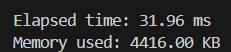

# Allen_Wang_miniproj_8

[](https://github.com/nogibjj/Allen_Wang_miniproj_8/actions/workflows/CICD.yml)
[](https://github.com/nogibjj/Allen_Wang_miniproj_8/actions/workflows/rust_CICD.yml)
## Overview

This project includes a Python development environment configured with a `.devcontainer`, a `Makefile` for managing setup, testing, and linting tasks, and a functioning CI/CD pipeline. The project reads a dataset (CSV or Excel) and generates summary statistics in both Python and Rust to compare time and memory usage.

## Features

- **Descriptive Statistics**: 
  - A Python script that reads a dataset (CSV or Excel) and generates summary statistics including mean, median, and standard deviation for numeric columns.

## Project Structure

- **.devcontainer/**: Configuration for a development container to ensure consistency, portability, and isolation. It includes:
  - `devcontainer.json`: Configuration file for the development container.
  - `Dockerfile`: Defines the container image for the development environment.

- **Makefile**: Provides commands for setup, testing, and linting:
  - `make install`: Installs project dependencies.
  - `make python_format`: Formats all Python files in the current directory using Black.
  - `make python_lint`: Lints all Python files (excluding test files) using Pylint.
  - `make python_test`: Runs python tests.

- **.github/workflows/ci.yml**: Configures the CI/CD pipeline to automatically run setup, linting, and tests.

- **main.py**: A script for reading a dataset, calculating summary statistics, and measuring time and memory usage for the summary function.

- **README.md**: This file, providing setup and usage instructions.

- **src/main.rs**: A Rust script for reading a dataset, calculating summary statistics, and measuring time and memory usage for the summary function.

## Setup

1. **Clone the repository:**

    ```bash
    git clone https://github.com/nogibjj/Allen_Wang_miniproj_8.git
    cd Allen_Wang_miniproj_8
    ```

2. **Install dependencies:**

    ```bash
    make install
    ```

3. **Format code:**

    ```bash
    make python_format
    ```

4. **Lint code:**

    ```bash
    make python_lint
    ```

5. **Test code:**

    ```bash
    make python_test
    ```

6. **Build Rust:**

    ```bash
    make release
    ```

## Data Analysis Script

The Python script in `main.py` and the Rust script in `src/main.rs` can perform the following:

### 1. **Read a Dataset**:
   They read a dataset from a CSV or Excel file.

### 2. **Generate Summary Statistics**:
   For each numeric column, the scripts generate:
   - Mean
   - Median
   - Standard Deviation

## Performance Comparison

The performance of the summary statistics generation was compared between Python and Rust, yielding the following results:

- **Python (using the Polar package)**:
  - **Time:** 31.96 ms
  - **Memory Usage:** 4416 KB
  
  

- **Rust (using basic sorting and mathematical functions)**:
  - **Time:** 4.55 ms
  - **Memory Usage:** 0 KB
  
  

### Analysis

The Rust implementation is faster and utilizes 0 KB of memory, while the Python implementation consumes 5240 KB of memory and takes longer to execute. This significant difference can be attributed to Rust's efficient handling of resources and its low-level control over memory management.

The Python implementation relies on the Polar library, which, while powerful and feature-rich for data manipulation, introduces additional overhead that affects both time and memory usage. In contrast, the Rust implementation uses manual sorting and basic mathematical functions, resulting in lower memory consumption and faster execution.

It's important to note that the performance outcomes could vary if the Python implementation were optimized by using more efficient libraries or techniques, similar to those employed in Rust. For instance, if Python were to utilize a high-performance package for its computations, the time and memory results might be more competitive with Rust's performance.
