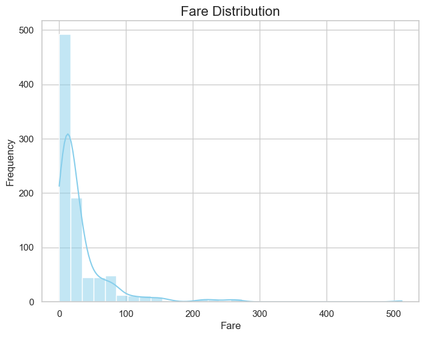

# Allen_Wang_miniproj_3

[](https://github.com/nogibjj/Allen_Wang_miniproj_3/actions/workflows/CICD.yml)

## Overview

This project includes a Python development environment configured with a `.devcontainer`, a `Makefile` for managing setup, testing, and linting tasks, and a functioning CI/CD pipeline.  The project reads a dataset (CSV or Excel), generates summary statistics, and creates basic data visualizations for the dataset columns.

## Features
- **Descriptive Statistics**: A Python script that:
  - Reads a dataset (CSV or Excel).
  - Generates summary statistics including mean, median, and standard deviation for numeric columns.
  - Creates a histogram for data visualization.

## Project Structure

- **.devcontainer/**: Contains configuration for a development container to ensure consistency, portability, and isolation. Includes:
  - `devcontainer.json`: Configuration file for the development container.
  - `Dockerfile`: Defines the container image for the development environment.

- **Makefile**: Provides commands for setup, testing, and linting:
  - `make install`: Installs project dependencies.
  - `make format`: Formats all Python files in the current directory using Black
  - `make lint`: Lints all Python files (excluding test files) using Pylint.
  - `make test`: Runs tests.
  - `make all`: Runs all the tasks in sequence.

- **.github/workflows/ci.yml**: Configures CI/CD pipeline to automatically run setup, linting, and tests.

- **main.py**: A script for reading a dataset, calculating summary statistics, and generating data visualizations.

- **README.md**: This file, providing setup and usage instructions.

## Setup

1. **Clone the repository:**

    ```bash
    git clone https://github.com/nogibjj/Allen_Wang_miniproj_3.git
    cd Allen_Wang_miniproj_3
    ```

2. **Install dependencies:**

    ```bash
    make install
    ```

3. **Format code:**

    ```bash
    make format
    ```
    
4. **Lint code:**

    ```bash
    make lint
    ```
   
5. **Test code:**

    ```bash
    make test
    ```
   

## Data Analysis Script

The Python script in `main.py` can perform the following:

### 1. **Read a Dataset**:
   It reads a dataset from a CSV or Excel file.

### 2. **Generate Summary Statistics**:
   For each numeric column, the script generates:
   - Mean
    
   - Median
    
   - Standard Deviation
    

### 3. **Data Visualization**:
   The script creates a histogram for the numeric columns in the dataset.
    
    
    
    


