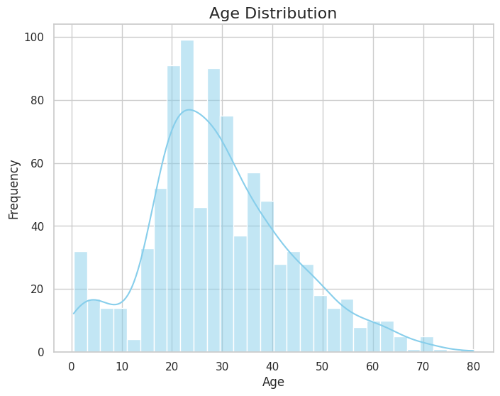
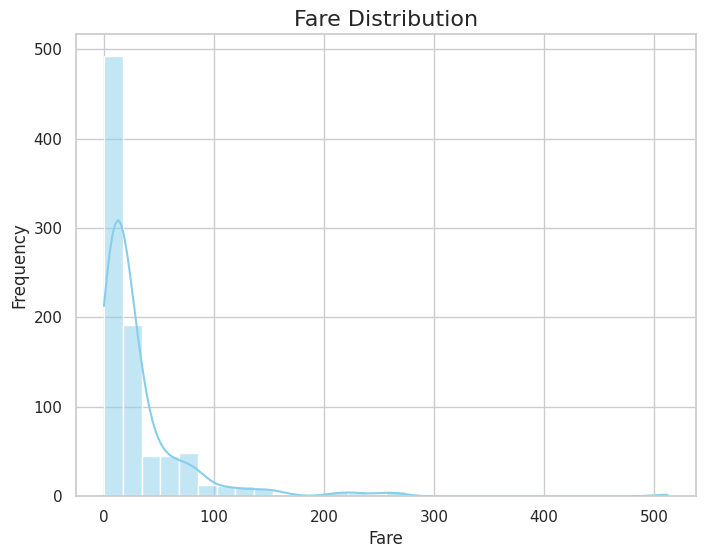
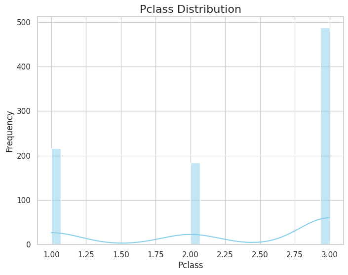

# Summary Report

| Metric          | Value           |
|------------------|----------------|
| **statistic**      | count        |
| **Survived**      | 887.0        |
| **Pclass**      | 887.0        |
| **Name**      | 887        |
| **Sex**      | 887        |
| **Age**      | 887.0        |
| **Siblings/Spouses Aboard**      | 887.0        |
| **Parents/Children Aboard**      | 887.0        |
| **Fare**      | 887.0        |
|------------------|----------------|
| **statistic**      | null_count        |
| **Survived**      | 0.0        |
| **Pclass**      | 0.0        |
| **Name**      | 0        |
| **Sex**      | 0        |
| **Age**      | 0.0        |
| **Siblings/Spouses Aboard**      | 0.0        |
| **Parents/Children Aboard**      | 0.0        |
| **Fare**      | 0.0        |
|------------------|----------------|
| **statistic**      | mean        |
| **Survived**      | 0.3855693348365276        |
| **Pclass**      | 2.305524239007892        |
| **Name**      | None        |
| **Sex**      | None        |
| **Age**      | 29.471443066516347        |
| **Siblings/Spouses Aboard**      | 0.5253664036076663        |
| **Parents/Children Aboard**      | 0.3833145434047351        |
| **Fare**      | 32.30542018038331        |
|------------------|----------------|
| **statistic**      | std        |
| **Survived**      | 0.48700411775101243        |
| **Pclass**      | 0.8366620036697731        |
| **Name**      | None        |
| **Sex**      | None        |
| **Age**      | 14.12190840546256        |
| **Siblings/Spouses Aboard**      | 1.10466855386757        |
| **Parents/Children Aboard**      | 0.8074659070316833        |
| **Fare**      | 49.78204040017391        |
|------------------|----------------|
| **statistic**      | min        |
| **Survived**      | 0.0        |
| **Pclass**      | 1.0        |
| **Name**      | Capt. Edward Gifford Crosby        |
| **Sex**      | female        |
| **Age**      | 0.42        |
| **Siblings/Spouses Aboard**      | 0.0        |
| **Parents/Children Aboard**      | 0.0        |
| **Fare**      | 0.0        |
|------------------|----------------|
| **statistic**      | 25%        |
| **Survived**      | 0.0        |
| **Pclass**      | 2.0        |
| **Name**      | None        |
| **Sex**      | None        |
| **Age**      | 20.5        |
| **Siblings/Spouses Aboard**      | 0.0        |
| **Parents/Children Aboard**      | 0.0        |
| **Fare**      | 7.925        |
|------------------|----------------|
| **statistic**      | 50%        |
| **Survived**      | 0.0        |
| **Pclass**      | 3.0        |
| **Name**      | None        |
| **Sex**      | None        |
| **Age**      | 28.0        |
| **Siblings/Spouses Aboard**      | 0.0        |
| **Parents/Children Aboard**      | 0.0        |
| **Fare**      | 14.4542        |
|------------------|----------------|
| **statistic**      | 75%        |
| **Survived**      | 1.0        |
| **Pclass**      | 3.0        |
| **Name**      | None        |
| **Sex**      | None        |
| **Age**      | 38.0        |
| **Siblings/Spouses Aboard**      | 1.0        |
| **Parents/Children Aboard**      | 0.0        |
| **Fare**      | 31.275        |
|------------------|----------------|
| **statistic**      | max        |
| **Survived**      | 1.0        |
| **Pclass**      | 3.0        |
| **Name**      | the Countess. of (Lucy Noel Martha Dyer-Edwards) Rothes        |
| **Sex**      | male        |
| **Age**      | 80.0        |
| **Siblings/Spouses Aboard**      | 8.0        |
| **Parents/Children Aboard**      | 6.0        |
| **Fare**      | 512.3292        |

## Mean Values:
- **Survived**: 0.3855693348365276
- **Pclass**: 2.305524239007892
- **Age**: 29.471443066516347
- **Siblings/Spouses Aboard**: 0.5253664036076663
- **Parents/Children Aboard**: 0.3833145434047351
- **Fare**: 32.30542018038331

## Median Values:
- **Survived**: 0.0
- **Pclass**: 3.0
- **Age**: 28.0
- **Siblings/Spouses Aboard**: 0.0
- **Parents/Children Aboard**: 0.0
- **Fare**: 14.4542

## Standard Deviation:
- **Survived**: 0.48700411775101243
- **Pclass**: 0.8366620036697731
- **Age**: 14.12190840546256
- **Siblings/Spouses Aboard**: 1.10466855386757
- **Parents/Children Aboard**: 0.8074659070316833
- **Fare**: 49.782040400173905

## Distributions:

